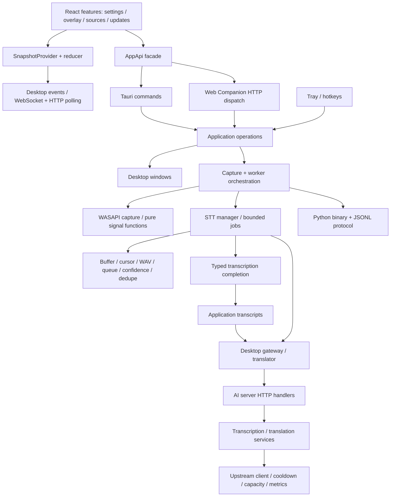

# WANGAI: ขอบเขตโมดูลและแนวทางพัฒนาต่อ

เอกสารนี้อธิบายโครงสร้างหลัง refactor วันที่ 2026-10-02 ใช้คู่กับ [ผลตรวจและข้อจำกัด](refactor-verification.md) และ [คู่มือ Portable](windows-portable.md) ไม่มีการเปลี่ยน schema หรือเพิ่ม migration ในรอบนี้

Desktop อยู่ใน `apps/desktop/` แล้ว: paths `src/`, `src-tauri/`, `portable/`, `worker/`, `assets/` และ `scripts/` ในส่วน Desktop ด้านล่างอ้างอิงจากโฟลเดอร์นี้ ส่วน `server/`, `ai-protocol/`, `.github/` และ `docs/` ยังอ้างอิงจาก repository root ดู [คู่มือ Desktop](../apps/desktop/README.md) สำหรับคำสั่งเริ่มต้น

## Dependency map



ลูกศรแสดงทางเรียกหลัก ไม่ได้แสดง shared types/state ทุกจุด `AppState` ยังเป็นเจ้าของทรัพยากรตลอดอายุแอป ส่วนการคำนวณเสียงและนโยบาย STT ทดสอบด้วยข้อมูลในหน่วยความจำได้โดยไม่สร้าง WebView หรือเปิด capture

## Frontend

| ตำแหน่ง | หน้าที่ |
| --- | --- |
| `src/features/settings/` | หน้าหลัก, draft ของ settings, hotkey recorder, panels เสียง/AI/overlay/hotkey |
| `src/features/overlay/` | แสดง subtitle, preview และเลือกข้อความที่ยังมองเห็น |
| `src/features/sources/` | เลือกแอป/ไมโครโฟนและ polling รายการแอป |
| `src/features/updates/` | UI และ adapter ของ updater ที่มี lifecycle แยกจาก snapshot |
| `src/state/` | Bootstrap/retry/cancel, provider ต่อ React root, reducer ของ desktop events |
| `src/transport/` | Typed `AppApi`, IPC, HTTP/session bootstrap, native listeners, WebSocket/reconnect |
| `src/shared/` | Error text, busy/error task hook และ UI helpers ที่ใช้พฤติกรรมร่วมกัน |

`main.tsx` สร้าง `SnapshotProvider` หนึ่งตัวต่อหน้าต่าง ส่วน settings หลักและ advanced อ่าน context เดียวกัน ห้ามเรียก `useSnapshotController` จาก feature หรือเปิด subscription ซ้ำใน panel; ใช้ `useSnapshot` เพื่ออ่าน snapshot/refresh เท่านั้น Provider ยกเลิก bootstrap ที่หมดอายุ และ listener ที่เพิ่งลงทะเบียนเสร็จหลัง unmount ต้องถูกถอดทันที

คงลำดับ CSS ใน `main.tsx`: `styles.css` แล้ว `desktop-theme.css` สี/spacing ของปุ่มใน main และ advanced ต่างกันตั้งแต่เดิม จึงมี style constants แยก ไม่ควรรวมเพียงเพราะชื่อเหมือนกัน Slider แชร์ implementation แต่รับ class ที่แต่ละหน้าต้องการ

เพิ่ม action ปกติที่ `transport/contract.ts` แล้ว implement ทั้ง `desktopApi.ts` และ `webApi.ts` UI เรียกผ่าน `api.ts`; อย่า import HTTP/IPC โดยตรงใน component การจับปุ่มอยู่ใน `useHotkeyRecorder` และ lifecycle ของคำสั่งอยู่ใน `useCommandTask` โดยแต่ละ feature ยังคง busy/toast ของตัวเอง

## Desktop

`commands.rs` เป็น Tauri adapter: รับ argument/ตรวจสิทธิ์ของหน้าต่าง แล้วเรียก `application/` Web Companion แปลง `WebCommand` ใน `web_companion/commands.rs` ไป operations ชุดเดียวกัน ห้ามเรียก Tauri command adapter จาก pipeline หรือ HTTP handler

- `application/listening.rs`: เริ่ม/หยุด session, เลือก/ล้างแหล่งเสียง, probe
- `application/settings.rs`: เปลี่ยน settings พร้อมผลข้างเคียง เช่น reattach, worker restart และ runtime events
- `application/transcripts.rs`: รับ STT completion, เพิ่ม history, แปล, ตรวจ generation ก่อนส่งผล
- `desktop_windows.rs`: เปิด/ซ่อน/จัดตำแหน่งและขนาดหน้าต่าง
- `pipeline.rs`: lifecycle ของ capture และรับ worker events
- `cloud_stt.rs`: stream manager; `cloud_stt/jobs.rs` คุมคิวและ gateway request; sibling modules เก็บนโยบายที่ไม่มี GUI
- `audio.rs`: Windows capture; `audio/signal.rs` เป็น gain, downmix, metering และ VAD auto-level
- `settings.rs`: transaction ของ settings; `settings/migration.rs`, `validation.rs`, `persistence.rs` แยกหน้าที่ migration, normalize/import validation และ atomic write

รักษาขอบเขต lock เดิม: ห้ามถือ runtime/settings lock ข้าม network await; STT มีได้หนึ่งงานกำลังทำและหนึ่งงานรอต่อ stream อย่าเพิ่มขนาดคิวหรือปล่อย permit ก่อน translation โดยไม่เปลี่ยนข้อกำหนดและ tests การหยุด/เปลี่ยนแหล่งเสียงเพิ่ม generation เฉพาะ stream ที่เกี่ยวข้อง ผล STT และคำแปลเก่าต้องไม่กลับมาเติม state

## Server และ worker

Server composition อยู่ที่ `server/src/lib.rs` โดยคง exports `Gateway`, `Failure`, `router`, `validate_wav`, `config`, `metrics`:

- `http.rs`: routes, extraction และ response mapping
- `services.rs`: validation และ flow ถอดเสียง/แปล
- `upstream.rs`: provider requests และจำแนก failure
- `gateway.rs`: config, shared state, capacity permits และผลการเรียก
- `health.rs`: cooldown และสถานะความพร้อม; `metrics.rs`: counters ที่ไม่เก็บบทสนทนา
- `wav.rs`: ตรวจ WAV; `error.rs`: public failure response

`ai-protocol` เป็น wire contract ร่วมกัน Desktop ยังคง response decoder ของตัวเองที่ยอมรับ optional confidence fields แล้วคัดกรองผลไม่ครบ ส่วน server ปฏิเสธ fields ที่จำเป็นหายไป ห้ามแทน decoder นี้ด้วย strict DTO โดยไม่ตั้งใจเปลี่ยน compatibility

Worker เข้าได้ที่ `worker/main.py` เหมือนเดิม แล้วส่งต่อ `wangai_worker/runtime.py` ซึ่งใช้ `protocol.py`, `vad.py`, `session.py` ตามลำดับหน้าที่ ตัวแพ็กยังชื่อ `wangai-worker.exe` และใช้ binary stdin / JSONL stdout เดิม เพิ่มโมดูล worker แล้วต้องตรวจ PyInstaller imports และรัน packaged-worker contract ไม่พอเพียงแค่ import Python source ผ่าน

## Compatibility ที่ต้องรักษา

- Native commands/events, HTTP routes/payload/error responses และ worker frame IDs ไม่เปลี่ยน
- Frontend device ID ใช้ camelCase สำหรับ IPC และ snake_case ใน HTTP command args ตามของเดิม
- Native `list_capture_sources`, `default_microphone_name`, `set_listening`, `inject_demo_transcript` ยังอยู่สำหรับ client เดิม/diagnostics แม้ไม่มี frontend wrapper แล้ว
- `set_overlay_presentation` เป็น compatibility no-op ทั้ง expanded/collapsed; อย่านำ collapse algorithm ที่เลิกใช้กลับมา
- Web dispatch ยังส่ง `settings-updated` หลังทุกคำสั่งสำเร็จ รวมกรณีที่ operation ส่งไปแล้วด้วย
- Native hotkey registration failure พยายามคืน registration เดิม ส่วน web เดิมไม่ทำใน failure ช่วงนี้ ทั้งสองคืนค่าเมื่อ persistence ล้มเหลว
- Native worker restart sync ค่า VAD เข้า runtime เพิ่มเติม; web restart คง behavior เดิม
- Settings schema 16, installation ID, backup/migration เดิม และการเขียน transaction ไม่เปลี่ยน
- Portable เก็บขอบเขต package/transaction, signature bytes, footer, artifact names, CLI, launcher replacement และ rollback ของเดิม ข้อมูล `Data` ไม่ใช่ package input

ความต่างสองช่องทางข้างต้นเป็น behavior ที่มีอยู่ก่อน refactor ไม่ได้อ้างว่าทั้งสอง transport เหมือนกันทุก event หรือ failure path

## จุดเพิ่มฟีเจอร์และการตรวจ

| งาน | เริ่มแก้ที่ | ชุดตรวจสำคัญ |
| --- | --- | --- |
| เพิ่ม field/หน้าตั้งค่า | feature panel → AppApi → application operation → settings validation | draft/save tests, native/web contracts, settings เก่า |
| เปลี่ยน subtitle | overlay feature + snapshot reducer | OverlayApp, overlayItems, reducer, ภาพก่อน–หลัง |
| เพิ่มแหล่งเสียง | sources UI + processes/audio adapters | stale selection, cursor, source switch, hardware smoke |
| เปลี่ยน STT/VAD | pure policy module ก่อน orchestration | stream isolation, bounded queue, confidence, worker contract |
| เปลี่ยน AI provider | server upstream/services/config | timeout/rate limit, redaction, strict protocol, container smoke |
| เปลี่ยน Portable | portable package/transaction หรือ named packaging stage | signed package tests, preview provenance, real upgrade/rollback |

จาก repository root บน Windows ให้เข้าโฟลเดอร์ Desktop ก่อน:

```powershell
cd apps/desktop
pnpm test
pnpm format:check
pnpm build # รวม noUnusedLocals/noUnusedParameters
cargo test --locked --manifest-path src-tauri/Cargo.toml
cargo test --locked --manifest-path ../../server/Cargo.toml
cargo test --locked --manifest-path portable/Cargo.toml --features host
cargo fmt --manifest-path src-tauri/Cargo.toml --check
cargo fmt --manifest-path ../../server/Cargo.toml --check
cargo fmt --manifest-path portable/Cargo.toml --check
cargo fmt --manifest-path ../../ai-protocol/Cargo.toml --check
.packaging-venv/Scripts/python.exe -m unittest discover -s worker -v
.packaging-venv/Scripts/python.exe scripts/test-portable-preview.py
.packaging-venv/Scripts/python.exe scripts/test-package-portable.py
./scripts/package-worker.ps1
$env:WANGAI_TEST_WORKER_EXE = (Resolve-Path output/worker/wangai-worker/wangai-worker.exe).Path
cargo test --locked --manifest-path src-tauri/Cargo.toml packaged_worker_events_follow_rust_contract -- --ignored --nocapture
```

Container smoke รันจาก repository root: `python scripts/test-server-container.py` ต้องมี Docker daemon และ build Linux container ได้ CI `verify.yml` รันรายการนี้ด้วย สำหรับ real Portable upgrade/rollback รันจาก `apps/desktop` ใช้ `scripts/build-test-portables.ps1` และ `scripts/test-portable-upgrade.py` ตาม workflow `installer-qa.yml` ซึ่งใช้ disposable signing key, loopback updater และข้อมูลทดสอบแยก; ห้ามเผยแพร่ artifacts/key เหล่านี้

แยก commit จัดรูปแบบออกจาก behavior/structure ทุกครั้ง และใส่ผลตรวจจริงกับข้อจำกัดไว้ใน PR อย่าอ้างว่า test ที่ผ่านด้วย mock ยืนยันอุปกรณ์เสียงหรือ hotkey ระดับ OS แล้ว
